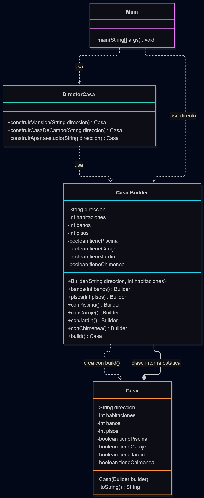

# Patrón Builder en Java

Tomás David Torres Morales - 20251020167
José Miguel Bueno Martinez - 20251020093
Jhomar Armando Bojaca Landinez - 20211020130

## Descripción

Builder es un patrón de diseño creacional. Se usa cuando un objeto tiene muchos datos y crearlo con un solo constructor se vuelve un lío. En lugar de pasar todos los valores de golpe, el objeto se va armando paso a paso con métodos que tienen nombre, y al final se llama a un método que lo entrega ya terminado.

Para explicarlo usamos un ejemplo sencillo: construir una **casa**.

## Estructura general



El diagrama se lee de arriba hacia abajo. El signo `-` significa privado, el `+` significa público, y las flechas punteadas significan "usa a".

- **Main** es el cliente, quien necesita casas. Tiene dos caminos: pedirle las casas al Director (flecha "usa") o armarlas él mismo con el Builder (flecha "usa directo").
- **DirectorCasa** guarda recetas ya definidas, como la mansión o el apartaestudio. Ojo: el Director no crea la casa por su cuenta, se la pide al Builder. Solo sabe qué pasos seguir. Es una pieza opcional del patrón.
- **Casa.Builder** es donde se arma la casa. Tiene los mismos atributos que `Casa`, un método por cada dato opcional (todos devuelven `Builder`, por eso se pueden encadenar uno tras otro) y el método `build()`, que entrega la casa terminada.
- **Casa** es el producto final. Fíjate en que su constructor lleva `-`, o sea que es privado: nadie puede hacer `new Casa(...)` desde afuera. La única forma de obtener una casa es pasando por el Builder (flecha "crea con build()").
- La línea con rombo, "clase interna estática", indica que `Builder` está escrito dentro de `Casa`.

## El problema

Imagina que estamos haciendo el sistema de una inmobiliaria y necesitamos representar casas. Toda casa tiene que tener una dirección y un número de habitaciones, pero el resto es opcional: baños, pisos, piscina, garaje, jardín y chimenea.

La primera idea que a uno se le ocurre es hacer varios constructores, uno por cada combinación:

```java
public class Casa {
    private String direccion;
    private int habitaciones;
    private int banos;
    private int pisos;
    private boolean tienePiscina;
    private boolean tieneGaraje;
    private boolean tieneJardin;
    private boolean tieneChimenea;

    public Casa(String direccion, int habitaciones) {
        this.direccion = direccion;
        this.habitaciones = habitaciones;
    }

    public Casa(String direccion, int habitaciones, int banos, int pisos) {
        this(direccion, habitaciones);
        this.banos = banos;
        this.pisos = pisos;
    }

    public Casa(String direccion, int habitaciones, int banos, int pisos,
                boolean tienePiscina, boolean tieneGaraje) {
        this(direccion, habitaciones, banos, pisos);
        this.tienePiscina = tienePiscina;
        this.tieneGaraje = tieneGaraje;
    }

    public Casa(String direccion, int habitaciones, int banos, int pisos,
                boolean tienePiscina, boolean tieneGaraje,
                boolean tieneJardin, boolean tieneChimenea) {
        this(direccion, habitaciones, banos, pisos, tienePiscina, tieneGaraje);
        this.tieneJardin = tieneJardin;
        this.tieneChimenea = tieneChimenea;
    }
}
```

Y así se crean las casas:

```java
Casa campestre = new Casa("Vereda El Roble", 3, 2, 2, true, true, true, true);
Casa sencilla  = new Casa("Calle 10 #5-20", 2, 0, 0, false, false, true, false);
Casa error     = new Casa("Carrera 7 #45-10", 1, 4, 1, false, true, false, false);
```

Funciona, pero tiene varios problemas:

1. **No se entiende qué es cada valor.** En la primera casa, ¿qué significan los cuatro `true` seguidos? Hay que abrir la clase y contar parámetros para saberlo.
2. **Hay que rellenar con valores basura.** La segunda casa solo debía tener jardín, pero tuvimos que escribir `0, 0, false, false` para llegar hasta ese parámetro.
3. **Los errores no los detecta el compilador.** En la tercera casa queríamos 4 habitaciones y 1 baño, pero escribimos `1, 4, 1`. Como `habitaciones`, `banos` y `pisos` son todos `int`, el código compila sin quejarse y la casa queda mal.
4. **Cada atributo nuevo duele.** Si mañana agregamos terraza o sótano, hay que crear otro constructor más. Esto se conoce como el problema del *constructor telescópico*.

## La solución

La idea es dejar de pasar todo en un solo constructor y armar la casa por partes. Para eso hacemos tres cosas:

1. Ponemos el constructor de `Casa` en **privado**, para que nadie pueda crearla directamente.
2. Creamos una clase interna `Builder` con **un método por cada dato opcional**. Cada método guarda el valor y devuelve `this` (el mismo Builder), lo que permite encadenar llamadas.
3. Agregamos un método `build()` que revisa que los datos tengan sentido y entrega la `Casa`.

Este es el código de `Casa.java`:

```java
public class Casa {

    // final: una vez creada la casa, sus datos ya no cambian
    private final String direccion;
    private final int habitaciones;
    private final int banos;
    private final int pisos;
    private final boolean tienePiscina;
    private final boolean tieneGaraje;
    private final boolean tieneJardin;
    private final boolean tieneChimenea;

    // Constructor privado: solo el Builder puede crear una Casa
    private Casa(Builder builder) {
        this.direccion = builder.direccion;
        this.habitaciones = builder.habitaciones;
        this.banos = builder.banos;
        this.pisos = builder.pisos;
        this.tienePiscina = builder.tienePiscina;
        this.tieneGaraje = builder.tieneGaraje;
        this.tieneJardin = builder.tieneJardin;
        this.tieneChimenea = builder.tieneChimenea;
    }

    @Override
    public String toString() {
        return "Casa [direccion=" + direccion + ", habitaciones=" + habitaciones
                + ", baños=" + banos + ", pisos=" + pisos
                + ", piscina=" + tienePiscina + ", garaje=" + tieneGaraje
                + ", jardín=" + tieneJardin + ", chimenea=" + tieneChimenea + "]";
    }

    // El Builder está dentro de Casa y es static para poder usarlo
    // sin tener antes una casa: new Casa.Builder(...)
    public static class Builder {

        // Obligatorios: entran por el constructor, así no se pueden olvidar
        private final String direccion;
        private final int habitaciones;

        // Opcionales: ya traen un valor por defecto
        private int banos = 1;
        private int pisos = 1;
        private boolean tienePiscina = false;
        private boolean tieneGaraje = false;
        private boolean tieneJardin = false;
        private boolean tieneChimenea = false;

        public Builder(String direccion, int habitaciones) {
            this.direccion = direccion;
            this.habitaciones = habitaciones;
        }

        // Cada método guarda el valor y devuelve "this" para poder encadenar
        public Builder banos(int banos) {
            this.banos = banos;
            return this;
        }

        public Builder pisos(int pisos) {
            this.pisos = pisos;
            return this;
        }

        public Builder conPiscina() {
            this.tienePiscina = true;
            return this;
        }

        public Builder conGaraje() {
            this.tieneGaraje = true;
            return this;
        }

        public Builder conJardin() {
            this.tieneJardin = true;
            return this;
        }

        public Builder conChimenea() {
            this.tieneChimenea = true;
            return this;
        }

        // Valida los datos y entrega la casa terminada
        public Casa build() {
            if (direccion == null || direccion.isBlank()) {
                throw new IllegalStateException("La casa necesita una dirección");
            }
            if (habitaciones < 1) {
                throw new IllegalStateException("La casa necesita al menos 1 habitación");
            }
            return new Casa(this);
        }
    }
}
```

Ahora las mismas casas de antes se crean así:

```java
Casa campestre = new Casa.Builder("Vereda El Roble", 3)
        .banos(2)
        .pisos(2)
        .conPiscina()
        .conGaraje()
        .conJardin()
        .conChimenea()
        .build();

Casa sencilla = new Casa.Builder("Calle 10 #5-20", 2)
        .conJardin()
        .build();
```

Se lee casi como una frase y solo se escribe lo que importa. Ya no hay que rellenar nada, y el error de la tercera casa desaparece porque cada número tiene su propio método: `.banos(1)` no se puede confundir con las habitaciones.

Como muchas casas se repiten (una mansión siempre lleva piscina, garaje y chimenea), agregamos el **Director**, que guarda esas recetas para no escribirlas una y otra vez. Este es `DirectorCasa.java`:

```java
public class DirectorCasa {

    public Casa construirMansion(String direccion) {
        return new Casa.Builder(direccion, 6)
                .banos(5)
                .pisos(3)
                .conPiscina()
                .conGaraje()
                .conJardin()
                .conChimenea()
                .build();
    }

    public Casa construirCasaDeCampo(String direccion) {
        return new Casa.Builder(direccion, 3)
                .banos(2)
                .pisos(1)
                .conJardin()
                .conChimenea()
                .build();
    }

    // Sin métodos opcionales: se queda con los valores por defecto
    public Casa construirApartaestudio(String direccion) {
        return new Casa.Builder(direccion, 1)
                .build();
    }
}
```

Si la receta de la mansión cambia, se modifica en este único lugar.

## Código para probar

Este es `Main.java`. Crea tres casas con el Director, una a medida con el Builder, y prueba que la validación funciona:

```java
public class Main {
    public static void main(String[] args) {

        DirectorCasa director = new DirectorCasa();

        // Con recetas del Director
        Casa mansion = director.construirMansion("Alto de las Palmas");
        Casa campo = director.construirCasaDeCampo("Vereda El Roble");
        Casa estudio = director.construirApartaestudio("Carrera 13 #50-20");

        // A medida, con el Builder directo: una mansión sin piscina
        Casa personalizada = new Casa.Builder("Calle 80 #20-10", 6)
                .banos(4)
                .pisos(2)
                .conGaraje()
                .conJardin()
                .build();

        System.out.println(mansion);
        System.out.println(campo);
        System.out.println(estudio);
        System.out.println(personalizada);

        // build() no deja crear una casa sin habitaciones
        try {
            new Casa.Builder("Calle 1 #1-1", 0).build();
        } catch (IllegalStateException e) {
            System.out.println("Error controlado: " + e.getMessage());
        }
    }
}
```


Salida esperada:

```text
Casa [direccion=Alto de las Palmas, habitaciones=6, baños=5, pisos=3, piscina=true, garaje=true, jardín=true, chimenea=true]
Casa [direccion=Vereda El Roble, habitaciones=3, baños=2, pisos=1, piscina=false, garaje=false, jardín=true, chimenea=true]
Casa [direccion=Carrera 13 #50-20, habitaciones=1, baños=1, pisos=1, piscina=false, garaje=false, jardín=false, chimenea=false]
Casa [direccion=Calle 80 #20-10, habitaciones=6, baños=4, pisos=2, piscina=false, garaje=true, jardín=true, chimenea=false]
Error controlado: La casa necesita al menos 1 habitación
```

## Cuándo usarlo y cuándo no

**Úsalo cuando:**

- El objeto tiene muchos parámetros y varios son opcionales.
- Hay parámetros del mismo tipo uno al lado del otro (varios `int` o varios `boolean`) y es fácil confundirlos.
- Quieres validar los datos antes de crear el objeto.
- Quieres que el objeto final no se pueda modificar después de crearlo.
- Hay configuraciones que se repiten y quieres guardarlas en un solo lugar (el Director).

**No lo uses cuando:**

- El objeto tiene dos o tres atributos y todos son obligatorios. Un constructor normal es más simple y el Builder solo agrega código de más.
- El objeto es muy simple o cambia constantemente después de creado. Ahí unos `setters` bastan.
- Solo vas a crear el objeto una vez en todo el programa. La estructura del Builder no se paga sola.
